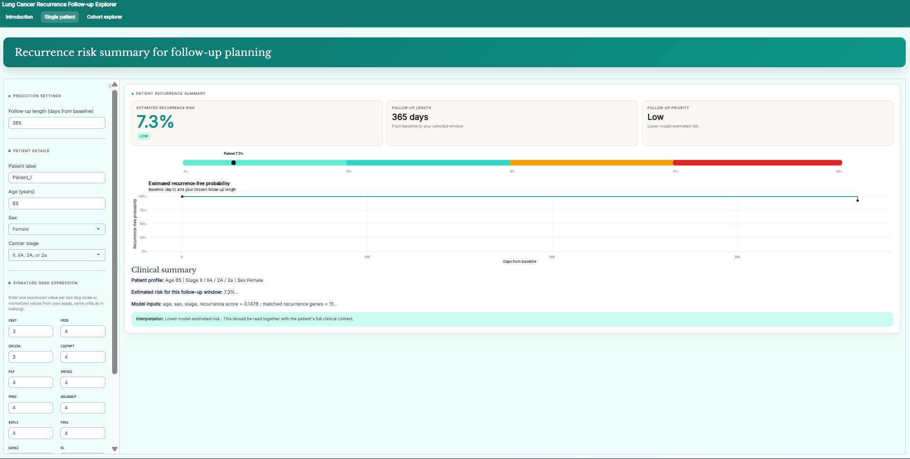

------------------------------------------------------------------------
```{r}
#| label: setup
#| message: false
#| warning: false
library(tidyverse)
library(knitr)
library(kableExtra)
library(gt)

results_path <- "../recur inter/pipeline/model result/evaluation/all_engines_all_results_combined.tsv"
if (!file.exists(results_path)) {
  results_path <- "all_engines_all_results_combined.tsv"
}
results <- read_tsv(results_path, show_col_types = FALSE)
selected_record_type <- paste0("official_", "loc", "ked")

# Baseline external metrics are produced by a re-run of the locked external
# evaluation (pipeline step 1). Guard so the report still renders if an older
# results file without these columns is used.
if (!"cindex_external_baseline" %in% names(results)) {
  results$cindex_external_baseline <- NA_real_
}
if (!"delta_cindex_external_full_minus_baseline" %in% names(results)) {
  results$delta_cindex_external_full_minus_baseline <- NA_real_
}

appendix_show <- function(rel_path, start, end) {
  root <- "../Pipeline and Shiny"
  full <- file.path(root, rel_path)
  if (!file.exists(full)) {
    cat("\n\n*Source not found:* `", rel_path, "`\n\n", sep = "")
    return(invisible(NULL))
  }
  lang <- if (grepl("\\.py$", rel_path, ignore.case = TRUE)) "python" else "r"
  lines <- readLines(full, warn = FALSE)
  end <- min(end, length(lines))
  if (start > end) return(invisible(NULL))
  snippet <- lines[seq.int(start, end)]
  cat("\n\n<details class=\"appendix-code-fold\">\n")
  cat(
    "<summary>Show code: <code>", rel_path,
    " (lines ", start, "-", end, ")</code></summary>\n\n",
    sep = ""
  )
  cat("```", lang, "\n", paste(snippet, collapse = "\n"), "\n```\n\n", sep = "")
  cat("</details>\n\n")
}
```

```{r}
#| label: write-packages-bib
#| echo: false
#| message: false
#| eval: false

# Packages used to generate this report.
installed <- rownames(installed.packages())

to_cite <- c("base", "tidyverse", "kableExtra", "survival")
to_cite <- to_cite[to_cite %in% installed]

knitr::write_bib(to_cite, file = "packages.bib")
```


# Executive Summary

**Background:** Lung adenocarcinoma (LUAD) is a common and clinically serious subtype of lung cancer [@siegel2023]. Recurrence risk is difficult to estimate from clinical stage alone because patients with similar stages can still have different molecular profiles and recurrence outcomes [@jones2021recurrence]. Published recurrence models show that genomic and transcriptomic features can add prognostic information [@xu2020recurrence; @shen2023], but these models need careful validation and clear control of data leakage.

**Methodology:** The project used two separated data streams from the Gene Expression Omnibus (GEO). Five brain metastasis studies define top 5, 10, and 15 brain metastasis gene lists, while four LUAD recurrence cohorts support model development. Batch effects across recurrence cohorts are corrected using ComBat, followed by feature selection with the limma framework. Model training uses nested leave-one-dataset-out cross-validation (LODO CV), with external validation on the independent GSE68465 cohort. Performance is evaluated using Harrell's concordance index (C-index), comparing the baseline model, using clinical variables and recurrence score, with the full model, metastasis score added to the baseline. Metastasis signature selection, recurrence modelling, and validation are kept separate to minimise data leakage.

**Findings:** The strongest full model was an elastic-net Cox model, with a mean LODO C-index of 0.668 and an external C-index of 0.688 on GSE68465. However, the added brain-metastasis score does not improve overall cross-cohort performance compared with the baseline model, which achieves a slightly higher mean LODO C-index of 0.670. Across all seven model engines, adding the brain-metastasis score lowers the LODO C-index, with external validation showing no meaningful gain (maximum $\Delta$ External = 0.001), suggesting limited incremental predictive value beyond the recurrence signal.

**Conclusion:** This project develops a reproducible LUAD recurrence-risk modelling framework and a Shiny prototype. The brain-metastasis score is biologically plausible, but it does not consistently improve prediction beyond clinical variables and the recurrence-derived score in the available GEO cohorts. For this reason, the final deployed model is the baseline elastic-net Cox model, using clinical variables and the recurrence score without the metastasis score. Future work should focus on newer and more compatible recurrence datasets, improved gene-expression standardisation, and less restrictive feature-selection strategies that preserve broader biological context rather than relying only on small top-ranked gene lists.

# Introduction

Lung adenocarcinoma (LUAD) is one of the most common subtypes of lung cancer and remains a major contributor to cancer-related mortality worldwide [@siegel2023]. A key clinical problem in LUAD is that recurrence risk is not fully explained by TNM stage. A genomic-pathologic model has been shown to predict recurrence better than TNM staging alone, supporting the need for molecular risk stratification [@jones2021recurrence]. 

Transcriptomic data are useful in this setting because gene expression can reflect active tumour states, including proliferation, immune activity, epithelial-mesenchymal transition, and metastatic potential. Several LUAD studies have therefore developed recurrence or survival models using gene expression together with clinical variables [@xu2020recurrence; @shen2023]. These studies support the idea that molecular features can add prognostic information beyond conventional clinical predictors.

A major challenge is that public transcriptomic models do not always generalise across cohorts. GEO studies can differ in platform, preprocessing, patient composition, and clinical annotation, so a recurrence model should be tested across independent datasets rather than only within a single cohort.

Brain metastasis is used because it is a common and clinically important form of distant recurrence in LUAD and is associated with aggressive tumour features, including lymphovascular invasion, higher primary-tumour metabolic activity, advanced stage, and TP53 mutation status [@dunne2024; @jones2021transcriptomic]. Biologically, lung-to-brain spread requires tumour cells to leave the primary tumour, survive dissemination, interact with or disrupt the blood-brain barrier, and adapt to the brain microenvironment [@yousefi2017]. These mechanisms overlap with broader recurrence biology and motivate the hypothesis that a lung-to-brain metastasis expression signature could capture metastatic potential not fully represented by recurrence-associated genes selected from primary LUAD cohorts alone.

This project therefore tests whether a brain-metastasis-derived transcriptomic score improves LUAD recurrence-risk prediction when combined with clinical variables and a recurrence-derived expression score.

# Methodology

## Workflow

The full analytical pipeline is summarised in @fig-workflow. It has five
stages: (A) frozen metastasis gene list construction; (B) recurrence
cohort harmonisation; (C) seven-engine model development with nested
LODO CV; (D) final model selection and external validation on GSE68465; and
(E) Shiny deployment. Path A defined only metastasis gene candidates.
Signed score weights are refit inside recurrence training folds, so
held-out patients do not influence feature selection, weighting, batch
correction, or model fitting. Pipeline steps (@tbl-pipeline-steps) and
implementation code are in the Appendix.

::: {#fig-workflow}
```{r}
#| echo: false
htmltools::includeHTML("pipeline_workflow.html")
```

Full pipeline overview. Path A freezes brain metastasis gene lists from
five GEO datasets. Path B harmonises four recurrence cohorts. Path C
runs the seven-engine nested LODO CV pipeline with train-only
preprocessing and selected K values. Path D evaluates the selected final
models on GSE68465. Path E deploys the selected recurrence risk
calculator in Shiny.
:::

## Data Sources

Two categories of public gene-expression datasets from the Gene Expression Omnibus (GEO) are used.

First, five GEO studies comparing primary LUAD tumours with brain metastasis samples define the metastasis-related gene list: GSE200563 (spatial transcriptomics), GSE271259 (bulk RNA sequencing), GSE161116, GSE248830, and GSE223499. Differential expression is performed separately for each dataset using limma [@ritchie2015] (@sec-appendix-limma-metastasis), and genes with false discovery rate (FDR)-adjusted p-values below 0.05 in at least one study are retained as brain metastasis candidates.

Second, four LUAD microarray cohorts with binary recurrence outcomes (recurred versus non-recurred) are used for model development: GSE31210 (n = 204), GSE30219 (n = 85), GSE37745 (n = 53), and GSE50081 (n = 124). Included patients require LUAD histology, recurrence status, follow-up days, TNM stage, age, and sex (@tbl-datasets).

GSE68465 (n = 362) is reserved exclusively for external validation and is not used in any model-development step. This minimises information leakage and supports an unbiased evaluation of model performance.

## Preprocessing

### Metastasis Signature Construction

For each of the five metastasis studies, differential expression analysis between brain metastasis and primary lung tumour samples is performed using the limma framework [@ritchie2015] (@sec-appendix-limma-metastasis). Genes are ranked according to the absolute value of their mean log fold-change (logFC) across studies in which they are statistically significant (FDR < 0.05) (@sec-appendix-metastasis-ranking).

Candidate metastasis gene lists are generated using the top 5, 10, and 15 ranked genes. The frozen Path A files contain gene symbols only, not imported logFC weights (@sec-appendix-freeze-genes). The recurrence training folds refit signed score weights using only LUAD development data (@sec-appendix-refit-metastasis).

### Recurrence Cohort Harmonisation

Probe identifiers from each microarray platform are mapped to HGNC gene symbols to ensure consistency. Where multiple probes correspond to the same gene, expression values are averaged to produce a single gene-level measurement per patient.

Clinical variables are harmonised across cohorts. TNM stage is encoded numerically (IA = 1 through IV = 7), sex is binarised (female = 0, male = 1), and follow-up time is standardised to days. GSE31210 expression values are transformed from linear expression scale using log2(x + 1) to align with other log-scale microarray datasets.


### Batch Correction

To reduce platform and laboratory variation while avoiding data leakage, ComBat batch correction is fitted only on the training cohorts within each cross-validation fold [@johnson2007] (@sec-appendix-combat). Held-out test expression values are standardised using the training-set mean and standard deviation after batch correction.

## Score Construction

Gene-expression signals are summarised into recurrence and metastasis scores rather than individual-gene predictors. This reduces dimensionality and noise while producing comparable patient-level molecular features across cohorts [@subramanian2005gsea; @hanzelmann2013gsva].

Both scores use the same weighted-mean form, with gene lists of size $k \in \{5, 10, 15\}$ and signed weights $w_i$ refit inside each training fold:

$$
\text{Score} = \frac{1}{k}\sum_{i=1}^{k} w_i \, E_i
$$

where $E_i$ is the batch-corrected expression of gene $i$ for the patient.

### Recurrence Score

Within each training fold, limma compares recurred and non-recurred patients (@sec-appendix-limma-recurrence). Genes with FDR $< 0.05$ are prioritised, otherwise they are ranked by absolute logFC. The top $k$ genes define the recurrence score.

### Metastasis Score

The gene list is frozen from Path A (@sec-appendix-freeze-genes) and restricted to genes measured in the LUAD recurrence cohorts. Signed weights are refit inside each training fold using recurrence training data only (@sec-appendix-refit-metastasis).

## Model Training and Validation

### Leave-One-Dataset-Out Cross-Validation

Model development uses nested leave-one-dataset-out cross-validation (LODO CV). In each outer fold, one GEO cohort is held out while the remaining three form the training set.

Within each outer fold, 5-fold inner cross-validation is performed on the training data to select the optimal recurrence and metastasis gene list sizes ($k_r \in \{5, 10, 15\}$, $k_m \in \{5, 10, 15\}$). For each engine, the $(k_r, k_m)$ pair with the highest mean inner-CV C-index across the four outer LODO folds is selected. The selected pair is then evaluated by outer LODO C-index. GSE68465 is used only once for external validation after this process.

### Model Engines

Seven predictive engines are evaluated using the same feature families: TNM stage, age, sex, recurrence score, and, for full models, the metastasis score. The engines are penalized Cox, LASSO Cox, Ridge Cox, Elastic-net Cox [@zou2005], Random Survival Forest [@ishwaran2008], XGBoost survival Cox, and logistic regression. For Cox-based models, regularisation parameters are tuned within model fitting.

### Evaluation Metrics

Model performance is primarily assessed using Harrell's concordance index (C-index) [@harrell1982], which measures whether patients with earlier recurrence receive higher predicted risk scores than patients with later or no recurrence. A C-index of 0.5 indicates random discrimination, while 1.0 indicates perfect discrimination.

For logistic regression, predicted recurrence probabilities are treated as continuous risk scores when calculating the C-index.

Baseline compared with full model performance tests whether the metastasis score adds value beyond clinical variables and the recurrence score.

## Justification of Analytical Choices

ComBat is applied within each cross-validation fold using training cohorts only. The held-out cohort is instead standardised using training-set statistics, preventing leakage from global normalisation.

LODO CV is selected instead of standard k-fold cross-validation because the recurrence cohorts originate from different laboratories, platforms, and patient populations. Unlike random patient-level splitting, LODO CV directly evaluates how well a model generalises to a completely independent cohort.

Harrell's C-index is chosen as the primary metric because recurrence is a time-to-event outcome with censoring. AUROC does not reflect time-to-event information and is reported only as a secondary descriptive metric. This evaluation strategy is consistent with prior LUAD recurrence signature studies that combine molecular predictors with independent validation to assess prognostic value [@xu2020recurrence].

# Results

## Metastasis Signature

Differential expression analysis across the five metastasis GEO datasets identified genes that differ between brain metastasis and primary lung tumours. The frozen top-5 metastasis list used by the pipeline contains GFAP, PLP1, SCGB1A1, SCGB3A2, and SCTR. Lung secretory genes such as SCGB1A1 [@ncbi_scgb1a1] and SCGB3A2 [@ncbi_scgb3a2], together with brain associated markers such as GFAP [@ncbi_gfap] and PLP1 [@ncbi_plp1], are biologically plausible for a primary lung versus brain metastasis contrast. These findings align with previous studies describing the neuroglial microenvironment of LUAD brain metastases [@jones2021transcriptomic; @dunne2024].

## Model Selection and Engine Comparison

Nested inner cross-validation selected one $(k_r, k_m)$ pair for each engine from all possible combinations. Elastic-net Cox had the highest mean LODO C-index among the seven selected full-model results with $k_r = 15$ and $k_m = 5$. No recurrence genes overlap the final metastasis genes in any selected engine combination, so the lack of improvement is not caused by direct gene duplication.

As summarised in @tbl-engine-comparison, the elastic-net Cox model achieves the strongest full-model LODO performance, with a mean LODO C-index of 0.668 and an external validation C-index of 0.688 on GSE68465, while its baseline model reached a mean LODO C-index of 0.670 and an external C-index of 0.688. The metastasis score therefore does not improve either validation metric. External C-index is slightly higher than the LODO estimate, which supports cohort-level validation rather than random patient splitting.

**The final selected model is therefore the elastic-net Cox baseline** (Stage, Age, and Recurrence Score at $k_r = 15$), refitted on all development cohorts for deployment. The deployed linear predictor is:

$$
\begin{aligned}
LP = 0.309 \times \text{Stage} + 0.0033 \times \text{Age} + 3.008 \times \text{RecurrenceScore}
\end{aligned}
$$

where

$$
\begin{aligned}
\text{RecurrenceScore} = \frac{1}{15}\big(&0.6896\,E_{\text{TUBA1C}} - 0.6425\,E_{\text{CHRDL1}} + 0.6281\,E_{\text{CDC45}} - 0.6166\,E_{\text{KRBOX4}} + 0.6096\,E_{\text{ALG3}} \\
&+ 0.6033\,E_{\text{FTCD}} - 0.6028\,E_{\text{SDPR}} + 0.6009\,E_{\text{MYBL2}} + 0.6006\,E_{\text{GAPDH}} + 0.5992\,E_{\text{UBE2C}} \\
&+ 0.5942\,E_{\text{TUBB3}} - 0.5921\,E_{\text{SCN7A}} + 0.5891\,E_{\text{CENPN}} + 0.5866\,E_{\text{PSME3}} + 0.5852\,E_{\text{FOXM1}}\big)
\end{aligned}
$$

and $E_{\text{gene}}$ denotes the expression value of that gene. The metastasis score is not included in the deployed baseline model because adding it does not improve LODO or external validation performance.

```{r}
#| label: tbl-engine-comparison
#| tbl-cap: "Selected model performance across all engines. Baseline = clinical variables plus recurrence score; Full = baseline plus brain-metastasis score. LODO metrics are averaged across four outer leave-one-dataset-out folds. External metrics are evaluated once on the held-out GSE68465 cohort. $\\Delta$ LODO and $\\Delta$ External are full minus baseline. The selected final model (elastic-net Cox) is marked with stars."
#| tbl-cap-location: bottom
#| echo: false

engine_table_order <- c(
  "penalized_cox", "ridge_cox", "elastic_net_cox", "logistic_regression",
  "random_survival_forest", "xgboost_survival_cox", "lasso_cox"
)

engine_tbl <- results |>
  filter(record_type == selected_record_type) |>
  mutate(
    engine = factor(engine, levels = engine_table_order),
    across(c(outer_cindex_lodo, mean_cindex_lodo_baseline,
             cindex_external, cindex_external_baseline),
           ~ round(as.numeric(.), 3)),
    delta_lodo = round(
      as.numeric(outer_cindex_lodo) - as.numeric(mean_cindex_lodo_baseline),
      3
    ),
    delta_external = round(
      as.numeric(cindex_external) - as.numeric(cindex_external_baseline),
      3
    ),
    `Kr / Km (Full)` = paste0(top_k_recurrence, " / ", top_k_metastasis),
    Engine = if_else(
      engine == "elastic_net_cox",
      paste0("\u2605 ", engine_label),
      engine_label
    )
  ) |>
  arrange(engine) |>
  select(
    Engine,
    `Kr / Km (Full)`,
    `LODO C-index Baseline` = mean_cindex_lodo_baseline,
    `LODO C-index Full` = outer_cindex_lodo,
    `Delta LODO (Full-Baseline)` = delta_lodo,
    `External C-index Baseline` = cindex_external_baseline,
    `External C-index Full` = cindex_external,
    `Delta External (Full-Baseline)` = delta_external
  )

engine_tbl |>
  gt() |>
  tab_style(
    style = list(
      cell_fill(color = "#eaf4fb"),
      cell_text(weight = "bold")
    ),
    locations = cells_body(
      columns = everything(),
      rows = grepl("Elastic-net Cox", Engine)
    )
  ) |>
  cols_align(align = "center", columns = -Engine) |>
  cols_align(align = "left", columns = Engine)
```

## Effect of the Brain-Metastasis Score

The main question is whether transcriptomic information from brain metastasis improves recurrence prediction. Across all seven model engines, adding the brain-metastasis score does not improve LODO performance (Figure 2). Δ LODO ranges from −0.002 for elastic-net Cox to −0.028 for XGBoost survival Cox. On external validation, Δ External is near zero for penalized Cox, ridge Cox, elastic-net Cox, and logistic regression, with a maximum improvement of only +0.001. Random survival forest and XGBoost showed small decreases of −0.004 and −0.010, respectively. LASSO Cox reached an external C-index of 0.50 for both baseline and full models, indicating no external discriminative ability on GSE68465. This may partly reflect instability of LASSO-based selection in high-dimensional, correlated gene-expression data, where sparse or arbitrary selection among correlated predictors can weaken risk ranking on an independent cohort [@tibshirani1997lassoCox; @zou2005; @wang2019precisionlasso].

This suggested that the metastasis signature may capture biological information already represented by the recurrence features, rather than adding independent predictive signal.

```{r}
#| label: fig-baseline-vs-full
#| fig-cap: "Comparison of mean LODO C-index between the baseline model (clinical features + recurrence score only) and the full model (adding the brain-metastasis score), for each engine. Points above the diagonal line indicate the full model outperforms baseline; points below indicate no improvement from adding the metastasis score. Most engines fall below the diagonal, indicating the brain-metastasis score did not consistently improve recurrence prediction."
#| fig-width: 6
#| fig-height: 5
#| echo: true

results |>
  filter(record_type == selected_record_type) |>
  mutate(
    baseline = as.numeric(mean_cindex_lodo_baseline),
    full     = as.numeric(outer_cindex_lodo),
    is_selected = engine == "elastic_net_cox"
  ) |>
  ggplot(aes(x = baseline, y = full,
             colour = is_selected, label = engine_label)) +
  geom_abline(slope = 1, intercept = 0,
              linetype = "dashed", colour = "grey50") +
  geom_point(size = 4) +
  geom_text(nudge_y = 0.006, size = 3.1, check_overlap = TRUE,
            show.legend = FALSE) +
  scale_colour_manual(values = c("FALSE" = "steelblue", "TRUE" = "firebrick"),
                      guide = "none") +
  scale_x_continuous(limits = c(0.6, 0.68)) +
  scale_y_continuous(limits = c(0.6, 0.68)) +
  labs(
    x = "Baseline LODO C-index\n(Clinical + Recurrence score)",
    y = "Full model LODO C-index\n(+ Metastasis score)",
    title = "Effect of adding the brain-metastasis score"
  ) +
  theme_bw(base_size = 12)
```

## External Validation and Cohort Stability

Per-fold nested LODO performance for the full elastic-net Cox model (recurrence top-15, metastasis top-5, $K_r/K_m = 15/5$) varies across held-out development cohorts (@fig-lodo-folds). C-index ranges from 0.613 (GSE50081) to 0.722 (GSE30219), with a mean of 0.668, and AUROC ranges from 0.571 (GSE37745) to 0.724 (GSE31210), with a mean of 0.647. This variation likely reflects differences in cohort composition, microarray platforms, and sample sizes rather than a failure of the modelling approach itself.

On the independent external cohort GSE68465 (n = 362), C-index is 0.688 and AUROC is 0.628, slightly above the mean LODO estimates (0.668 and 0.647), indicating that the model retains useful risk ranking on unseen data.

```{r}
#| label: fig-lodo-folds
#| fig-cap: "Per-fold nested LODO performance for the full elastic-net Cox model ($K_r/K_m = 15/5$) across four held-out development cohorts, with mean reference lines (dashed) and external validation on GSE68465."
#| fig-width: 8
#| fig-height: 4.5
#| echo: true

cohort_order <- c(
  "GSE30219", "GSE31210", "GSE37745", "GSE50081", "GSE68465 (external)"
)

lodo_folds <- results |>
  filter(
    record_type == "lodo_holdout_fold",
    engine == "elastic_net_cox",
    is_baseline %in% c(FALSE, "FALSE", "false", "0") | is.na(is_baseline),
    !is.na(outer_cindex_lodo),
    outer_cindex_lodo != "NA"
  ) |>
  transmute(
    cohort = factor(holdout_dataset, levels = cohort_order),
    C_index = as.numeric(outer_cindex_lodo),
    AUROC = as.numeric(outer_auroc_lodo)
  ) |>
  pivot_longer(c(C_index, AUROC), names_to = "metric", values_to = "value") |>
  mutate(
    metric = recode(metric, C_index = "C-index", AUROC = "AUROC"),
    validation = "LODO"
  )

external_metrics <- results |>
  filter(record_type == selected_record_type, engine == "elastic_net_cox") |>
  transmute(
    C_index = as.numeric(cindex_external),
    AUROC = as.numeric(auroc_external)
  ) |>
  pivot_longer(everything(), names_to = "metric", values_to = "value") |>
  mutate(
    metric = recode(metric, C_index = "C-index", AUROC = "AUROC"),
    cohort = factor("GSE68465 (external)", levels = cohort_order),
    validation = "External"
  )

plot_data <- bind_rows(lodo_folds, external_metrics)

mean_lines <- tibble(
  metric = c("C-index", "AUROC"),
  value = c(0.668, 0.647)
)

ggplot(plot_data, aes(x = cohort, y = value, colour = metric)) +
  geom_line(
    data = filter(plot_data, validation == "LODO"),
    aes(group = metric),
    linewidth = 0.7
  ) +
  geom_point(aes(shape = validation), size = 3.2) +
  geom_hline(
    data = mean_lines,
    aes(yintercept = value, colour = metric),
    linetype = "dashed",
    linewidth = 0.5,
    alpha = 0.7
  ) +
  scale_colour_manual(values = c("C-index" = "firebrick", "AUROC" = "steelblue")) +
  scale_shape_manual(values = c("LODO" = 16, "External" = 17)) +
  scale_y_continuous(limits = c(0.50, 0.75), breaks = seq(0.50, 0.75, 0.05)) +
  labs(
    x = "Held-out cohort",
    y = "Performance",
    colour = "Metric",
    shape = "Validation",
    title = "Per-fold LODO performance - full elastic-net Cox model"
  ) +
  theme_bw(base_size = 12) +
  theme(
    legend.position = "bottom",
    panel.grid.minor = element_blank(),
    axis.text.x = element_text(angle = 25, hjust = 1)
  )
```

## Shiny Application Deployment

The deployment stage translates the modelling pipeline into an interactive [Shiny web application](https://elenna-shine-shiny.shinyapps.io/shiny_recurrence_app/) (see Appendix, @fig-shiny-main). The deployed app uses an elastic-net Cox baseline model with clinical variables and a recurrence score, because the model comparison shows that the metastasis score does not provide a consistent improvement. Users can enter TNM stage, age, sex, follow-up horizon, and the required recurrence gene expression values to obtain an estimated recurrence risk output.


# Discussion

Brain metastasis is a severe LUAD outcome with distinct genomic, immune, and transcriptomic features [@chen2021brain; @dunne2024; @jones2021transcriptomic]. This supports the biological rationale for testing a lung-to-brain metastasis score. However, the score does not provide consistent incremental value beyond clinical variables and the recurrence-derived score in the available GEO cohorts, so the final deployed model is the baseline elastic-net Cox model.

This result does not mean that brain-metastasis biology is irrelevant to recurrence. A more likely interpretation is that the recurrence score already captures part of the aggressive tumour biology represented by the metastasis signature. Consistent with this, the metastasis coefficient in the final elastic-net Cox model is shrunk to zero during regularisation, indicating that much of the metastasis-associated information overlaps with recurrence-derived transcriptomic features already included in the model. Lung-to-brain spread involves dissemination from the primary tumour, interaction with the blood-brain barrier, and adaptation to the brain microenvironment [@yousefi2017]. These processes overlap conceptually with broader recurrence biology, including invasion, immune escape, and tumour-microenvironment adaptation. Even when the selected recurrence and metastasis genes do not directly overlap, their signals may therefore overlap at the pathway or biological-program level.

A second explanation is that the metastasis score may compress the biology too strongly. Small top-ranked gene lists make nested validation computationally feasible and make the Shiny prototype more practical, but recurrence and metastasis are not driven by isolated markers alone. Gene-set methods were developed partly because expression data are noisy and biological activity is often distributed across coordinated groups of genes [@subramanian2005gsea; @hanzelmann2013gsva]. The top-gene score may therefore capture the strongest lung-to-brain contrast while missing weaker, coordinated signals that would better represent the full metastatic programme.

## Limitations

Several limitations should be considered. 

First, the recurrence datasets were public microarray cohorts rather than modern, harmonised RNA-seq cohorts. These cohorts provide recurrence-related expression data but were generated on older array platforms and were not designed around a common recurrence endpoint.

Second, the metastasis signature was derived only from brain-metastasis datasets. This matched the lung-to-brain hypothesis, but the recurrence endpoint in the LUAD cohorts was not brain-specific. Recurrence may include locoregional relapse, intrapulmonary recurrence, or distant metastasis to multiple organs, so a brain-metastasis-derived signature may represent only one component of broader recurrence biology. A lung-specific or multi-site metastatic expression signature may have been more aligned with the recurrence endpoint, but no suitable public dataset meeting the project’s inclusion criteria was identified. Therefore, the metastasis score may have captured brain-specific metastatic biology rather than the full range of relapse mechanisms in LUAD.

Third, the top-gene design may have limited the predictive signal. Small gene lists reduced computation and made deployment more practical, but they may exclude weaker genes that are individually modest yet biologically coordinated. 

Fourth, gene availability differed across microarray platforms, so some high-ranking metastasis genes were not consistently measured in every recurrence cohort. 

Finally, some held-out cohorts were small, particularly GSE37745, making fold-level estimates less stable.


## Future Directions

Future work should improve both biological representation and dataset compatibility. Newer LUAD recurrence datasets with RNA-seq expression and consistent recurrence annotation would reduce dependence on older microarray cohorts. Future studies should also test metastasis signatures from other metastatic sites, or multi-site metastasis signatures, because LUAD recurrence is not always brain-specific and may involve locoregional relapse, intrapulmonary recurrence, or distant metastasis to multiple organs. Subgroup analysis by pathological stage and mutation context should also be explored, because recurrence risk can differ across clinicopathologic and molecular LUAD subgroups [@jones2021recurrence; @stephanie2021].


## Conclusion

This study develops a reproducible LUAD recurrence-risk modelling framework using public transcriptomic cohorts, nested leave-one-dataset-out validation, external validation, and Shiny deployment. Although the metastasis-informed score does not improve predictive performance in this dataset, the modelling pipeline demonstrates a rigorous approach for integrating external biological signatures while minimising information leakage and evaluation bias.

The deployed Shiny application further illustrates the potential for translating reproducible machine learning pipelines into accessible research prototypes.


# Student Contributions

**550167750** conducted data collection, preprocessing, and harmonisation across LUAD recurrence and brain metastasis GEO datasets. Developed and implemented the recurrence-risk prediction pipeline, including nested cross-validation, leave-one-dataset-out evaluation, and external validation. Co-designed the project presentation slides including 
pipeline schematics and result summaries. 
Contributed to statistical analyses, visualisation, and interpretation of 
model performance. Led report writing, editing, formatting, and final 
manuscript revision.

**530616715** conducted data collection, preprocessing, and harmonisation across LUAD recurrence and brain metastasis GEO datasets. Developed and implemented the recurrence-risk prediction pipeline alongside nested 
cross-validation and external validation analyses. Contributed to the 
metastasis-derived transcriptomic scoring framework and biological 
interpretation of findings. Contributed to all Shiny app materials and 
its demonstration. Co-designed the project presentation slides including 
pipeline schematics and result summaries. Contributed to refined report 
writing, editing, formatting, and final manuscript revision.

**540094367** contributed to statistical analyses, visualisation, and 
interpretation of model performance results. Assisted with report writing, 
editing, formatting, and revision of the final manuscript. Contributed to 
meeting records and meeting minutes writing. Supported preparation of the 
reproducible QMD workflow and supplementary materials.

**530598798** contributed to statistical analyses, visualisation, and 
interpretation of model performance results. Assisted in preparing the 
reproducible QMD workflow, code integration, and organisation of 
supplementary materials and appendices. Contributed to meeting records 
and meeting minutes writing.

**540673139** contributed to statistical analyses, visualisation, and 
interpretation of model performance results. Co-designed the project 
presentation slides, including pipeline schematics and visual presentation 
materials. Assisted in preparing the reproducible QMD workflow and 
supplementary materials. Contributed to meeting records and meeting 
minutes writing.

# References

::: {#refs}
:::

# AI Declaration

We declare that AI tools were used only to assist with improving the clarity and precision of writing, locating relevant literature, and assisting with coding-related troubleshooting and implementation. AI was not used to generate or complete the core content of this assignment. All research questions, methodological decisions, analyses, interpretations, and conclusions were developed and evaluated by the project team. The final report was reviewed, revised, and approved by all team members.

# Appendix

```{r}
#| label: tbl-pipeline-steps
#| tbl-cap: "Pipeline paths A-E (@fig-workflow), scripts, and primary outputs. Paths are relative to Pipeline and Shiny/."
#| tbl-cap-location: bottom
#| echo: false
#| message: false

tribble(
  ~Path, ~Stage, ~Script, ~Purpose, ~`Primary output`,
  "A", "Frozen metastasis signature", "pipeline/steps/step0a_metastasis.sh", "limma DE on five GEO studies; rank by effect size; freeze top-5/10/15 gene lists", "pipeline/frozen/frozen_A_sig_top*.tsv",
  "B", "Recurrence development cohorts", "pipeline/steps/step0b_integrate.R", "Download and harmonise four recurrence cohorts; merge expression RDS", "pipeline/data/training/*.rds",
  "C", "Nested LODO CV per engine", "pipeline/run.R, pipeline/steps/step1_run_all_engines.R", "Seven engines; train-only preprocessing; inner K selection", "pipeline/model result/<engine>/",
  "D", "Final model selection and external validation", "pipeline/steps/step2_evaluate.R, step3_combine.R", "Aggregate inner-CV recommendations; validate on GSE68465", "pipeline/model result/evaluation/all_engines_all_results_combined.tsv",
  "E", "Shiny deployment", "shiny_recurrence_app/app.R", "Interactive recurrence risk calculator", "https://elenna-shine-shiny.shinyapps.io/shiny_recurrence_app/"
) |>
  kable(booktabs = TRUE, align = c("l", "l", "l", "l", "l")) |>
  kable_styling(full_width = TRUE, font_size = 11)
```

### Frozen and deployed gene lists

```{r}
#| label: tbl-gene-lists
#| tbl-cap: "Path A frozen metastasis genes ($k_m = 5$) and deployed recurrence-score genes with refitted weights. The Shiny baseline uses Stage, Age, and RecurrenceScore only; the metastasis score is not included because the elastic-net Cox full model shrinks its coefficient to zero. Refitted metastasis weights (all development data) are shown for SCGB1A1 and SCTR, the only frozen top-5 genes measured on the recurrence microarray platforms; GFAP, PLP1, and SCGB3A2 are absent from those platforms and therefore could not enter the metastasis score."
#| tbl-cap-location: bottom
#| echo: false
#| message: false

frozen_top5 <- c("GFAP", "PLP1", "SCGB1A1", "SCGB3A2", "SCTR")

metastasis_dev_weights <- c(
  GFAP = NA_real_, PLP1 = NA_real_, SCGB1A1 = -0.3542,
  SCGB3A2 = NA_real_, SCTR = -0.3797
)

deployed_weights <- c(
  TUBA1C = 0.6896, CHRDL1 = -0.6425, CDC45 = 0.6281, KRBOX4 = -0.6166,
  ALG3 = 0.6096, FTCD = 0.6033, SDPR = -0.6028, MYBL2 = 0.6009,
  GAPDH = 0.6006, UBE2C = 0.5992, TUBB3 = 0.5942, SCN7A = -0.5921,
  CENPN = 0.5891, PSME3 = 0.5866, FOXM1 = 0.5852
)

format_gene_weight <- function(w) {
  if_else(
    is.na(w),
    "absent from recurrence microarrays",
    as.character(round(w, 4))
  )
}

gene_tbl <- bind_rows(
  tibble(
    List = "Frozen metastasis (top 5, k_m = 5)",
    Gene = frozen_top5,
    Weight = format_gene_weight(metastasis_dev_weights[frozen_top5])
  ),
  tibble(
    List = "Deployed recurrence score (k_r = 15)",
    Gene = names(deployed_weights),
    Weight = format_gene_weight(as.numeric(deployed_weights))
  )
)

gene_tbl |>
  kable(booktabs = TRUE, align = c("l", "l", "l")) |>
  kable_styling(full_width = TRUE, font_size = 11) |>
  pack_rows("Path A - frozen metastasis genes", 1, 5) |>
  pack_rows("Deployed baseline recurrence score", 6, 20)
```

## Main Code

Implementation excerpts from `Pipeline and Shiny/pipeline/`.

### Limma differential expression (metastasis GEO) {#sec-appendix-limma-metastasis}

```{r}
#| echo: false
#| results: asis
#| message: false
appendix_show("pipeline/steps/step0a_metastasis.py", 24, 63)
```

### Metastasis gene ranking by effect size {#sec-appendix-metastasis-ranking}

```{r}
#| echo: false
#| results: asis
#| message: false
appendix_show("pipeline/steps/step0a_metastasis.py", 250, 285)
```

### Frozen metastasis gene lists {#sec-appendix-freeze-genes}

```{r}
#| echo: false
#| results: asis
#| message: false
appendix_show("pipeline/steps/step0a_metastasis.py", 288, 299)
appendix_show("pipeline/steps/helpers.R", 341, 355)
```

### Limma recurrence gene ranking {#sec-appendix-limma-recurrence}

```{r}
#| echo: false
#| results: asis
#| message: false
appendix_show("pipeline/steps/helpers.R", 279, 293)
```

### Refit metastasis score weights within each fold {#sec-appendix-refit-metastasis}

```{r}
#| echo: false
#| results: asis
#| message: false
appendix_show("pipeline/steps/helpers.R", 265, 276)
appendix_show("pipeline/steps/helpers.R", 357, 391)
```

### Train-only ComBat and test standardisation {#sec-appendix-combat}

```{r}
#| echo: false
#| results: asis
#| message: false
appendix_show("pipeline/steps/helpers.R", 224, 262)
```

## Shiny Application

The [recurrence risk calculator Shiny web application](https://elenna-shine-shiny.shinyapps.io/shiny_recurrence_app/).

````{r}
#| label: fig-shiny-main
#| fig-cap: "Overview of the LUAD Recurrence Risk Calculator Shiny application."
#| echo: false
#| out-width: "100%"


````

````{r}
#| label: fig-shiny-output
#| fig-cap: "Users input clinical variables (TNM stage, age, sex) and gene expression values to obtain a personalised recurrence risk probability. Risk output panel of the Shiny application showing predicted recurrence probability for an example patient."
#| echo: false
#| eval: false
#| include: false
#| out-width: "100%"


````

## Datasets


```{r}
#| label: tbl-datasets
#| tbl-cap: "Summary of GEO datasets used in this study. $N$ is the number of patients or samples retained after each dataset's inclusion criteria and passed into the corresponding analysis (Path A limma for metastasis datasets; Path B recurrence modelling or Path D external validation for microarray cohorts). Feature size ($p$) is the number of genes or measured features entering differential expression or recurrence modelling after probe-to-gene mapping and harmonisation; recurrence cohorts share 13,298 HGNC genes mapped across all four development cohorts and GSE68465."
#| tbl-cap-location: bottom
#| echo: false
#| message: false

tribble(
  ~`GEO Accession`, ~Purpose, ~`Sample composition`, ~N, ~`Feature size (p)`, ~Platform,
  "GSE200563", "Metastasis sig.", "NSCLC with paired brain metastases", "35", "18,694 genes", "10x Visium Spatial (GPL21697)",
  "GSE271259", "Metastasis sig.", "LUAD brain metastasis samples", "34", "19,947 genes", "Illumina NovaSeq (GPL24676)",
  "GSE161116", "Metastasis sig.", "17 brain metastasis (B) + 11 lung (L)", "28", "784 features", "NanoString nCounter (GPL19965)",
  "GSE248830", "Metastasis sig.", "11 BM-LUAD samples", "44", "784 features", "NanoString nCounter IO 360 (GPL32069)",
  "GSE223499", "Metastasis sig.", "31 NSCLC brain metastases + 12 primary NSCLC", "43", "277,206 cells", "10x Chromium scRNA-seq (GPL20301)",
  "GSE31210", "Recurrence dev.", "LUAD with recurrence outcome", "204", "13,298 genes", "Affymetrix HG-U133 Plus 2.0 (GPL570)",
  "GSE30219", "Recurrence dev.", "LUAD with recurrence outcome", "85", "13,298 genes", "Affymetrix HG-U133 Plus 2.0 (GPL570)",
  "GSE37745", "Recurrence dev.", "LUAD with recurrence outcome", "53", "13,298 genes", "Affymetrix HG-U133 Plus 2.0 (GPL570)",
  "GSE50081", "Recurrence dev.", "LUAD with recurrence outcome", "124", "13,298 genes", "Affymetrix HG-U133 Plus 2.0 (GPL570)",
  "GSE68465", "External val.", "Held-out LUAD with progression/relapse outcome", "362", "13,298 genes", "Affymetrix HG-U133 Plus 2.0 (GPL570)"
) |>
  kable(
    booktabs = TRUE,
    align = c("l", "l", "l", "c", "r", "l"),
    col.names = c(
      "GEO Accession", "Purpose", "Sample composition", "N",
      "Feature size (p)", "Platform"
    )
  ) |>
  kable_styling(full_width = TRUE, font_size = 10) |>
  column_spec(1, width = "7em") |>
  column_spec(2, width = "7em") |>
  column_spec(3, width = "13em") |>
  column_spec(4, width = "2.2em", extra_css = "padding-left: 0.35rem; padding-right: 0.35rem;") |>
  column_spec(5, width = "7.5em", extra_css = "padding-right: 1.25rem; white-space: nowrap;") |>
  column_spec(6, width = "14em", extra_css = "padding-left: 0.75rem;") |>
  pack_rows("Metastasis Signature Datasets (Path A)", 1, 5) |>
  pack_rows("Recurrence Development Datasets (Path B)", 6, 9) |>
  pack_rows("External Validation Dataset (Path D)", 10, 10)
```


## Terminology

```{r}
#| label: tbl-terminology
#| tbl-cap: "Definitions of all key terms, abbreviations, and methods used in this report."
#| tbl-cap-location: bottom
#| echo: false
#| message: false

term_df <- tribble(
  ~Term, ~Category, ~Definition,

  # --- Cancer & Biology ---
  "LUAD",
  "Biology",
  "Lung adenocarcinoma. The most common histological subtype of non-small cell lung cancer, arising from alveolar epithelial cells.",

  "Recurrence",
  "Biology",
  "Return of cancer after a period without detected disease. Classified as binary (recurred = 1, non-recurred = 0) in this study.",

  "Brain metastasis",
  "Biology",
  "The spread of cancer cells from the primary lung tumour to the brain. Represents an aggressive metastatic state associated with poor prognosis.",

  "Surgical resection",
  "Biology",
  "Surgical removal of a tumour. Relevant to many LUAD recurrence cohorts, but not used here as the sole framing of the study.",

  "TNM stage",
  "Biology",
  "Tumour-Node-Metastasis staging system used to classify cancer severity. Encoded numerically in this study (Stage IA = 1 through Stage IV = 7).",

  "Adjuvant therapy",
  "Biology",
  "Additional treatment given after surgery to reduce recurrence risk, such as chemotherapy or targeted therapy.",

  "Transcriptomic data",
  "Biology",
  "Gene expression measurements capturing the quantity of RNA produced by genes in a tissue sample. Used here from microarray platforms.",

  "HGNC gene symbol",
  "Biology",
  "Standardised gene name assigned by the HUGO Gene Nomenclature Committee. Used to harmonise gene identifiers across different microarray platforms.",

  "Probe",
  "Biology",
  "A short nucleotide sequence on a microarray that binds to a complementary RNA sequence, producing a fluorescence signal used to measure gene expression.",

  # --- Data & Platforms ---
  "GEO",
  "Data",
  "Gene Expression Omnibus. A public repository hosted by NCBI containing gene expression datasets submitted by researchers worldwide.",

  "GSE31210",
  "Data",
  "LUAD microarray recurrence cohort (n = 204 after inclusion filters). Used for model development. Expression values required log2(x+1) transformation.",

  "GSE30219",
  "Data",
  "LUAD microarray recurrence cohort (n = 85). Used for model development.",

  "GSE37745",
  "Data",
  "LUAD microarray recurrence cohort (n = 53). Used for model development.",

  "GSE50081",
  "Data",
  "LUAD microarray recurrence cohort (n = 124). Used for model development.",

  "GSE68465",
  "Data",
  "Independent LUAD microarray cohort (n = 362). Reserved exclusively for external validation; never used during any stage of model development or tuning.",

  "GSE200563",
  "Data",
  "Brain metastasis GEO dataset (n = 35 paired patients; 18,694 genes). 10x Visium Spatial (GPL21697). Used for metastasis signature construction only.",

  "GSE271259",
  "Data",
  "Brain metastasis GEO dataset (n = 34 samples; 19,947 genes). Illumina NovaSeq (GPL24676). Used for metastasis signature construction only.",

  "GSE161116",
  "Data",
  "Brain metastasis GEO dataset (n = 28 samples; 784 features). NanoString nCounter (GPL19965). Used for metastasis signature construction only.",

  "GSE248830",
  "Data",
  "Brain metastasis GEO dataset (n = 44 samples; 784 features). NanoString nCounter IO 360 (GPL32069). Used for metastasis signature construction only.",

  "GSE223499",
  "Data",
  "Brain metastasis GEO dataset (n = 43 patients; 277,206 cells). 10x Chromium scRNA-seq (GPL20301). Used for metastasis signature construction only.",

  "Microarray",
  "Data",
  "A high-throughput technology for measuring gene expression across thousands of genes simultaneously. Produces probe-level intensity values.",

  "Spatial transcriptomics",
  "Data",
  "A technique that measures gene expression while preserving the spatial location of cells within a tissue section.",

  "Bulk RNA-seq",
  "Data",
  "RNA sequencing performed on a mixture of cells from a tissue sample, producing average gene expression values across all cells present.",

  "Cohort heterogeneity",
  "Data",
  "Systematic differences between datasets arising from different patient populations, sample collection protocols, or laboratory environments.",

  # --- Preprocessing ---
  "logFC",
  "Preprocessing",
  "Log fold-change. The log2 ratio of mean gene expression between two groups (e.g. brain metastasis vs primary lung). Used to rank genes by differential expression magnitude.",

  "FDR",
  "Preprocessing",
  "False Discovery Rate. A method for correcting p-values when performing many simultaneous statistical tests. Genes with FDR-adjusted p-value < 0.05 were retained.",

  "limma",
  "Preprocessing",
  "Linear Models for Microarray Data. An R/Bioconductor package used here for differential expression analysis between two groups of samples.",

  "ComBat",
  "Preprocessing",
  "An empirical-Bayes batch-adjustment method for continuous expression data. In this project it was applied within each CV fold using training cohorts only to prevent data leakage.",

  "Batch effect",
  "Preprocessing",
  "Systematic technical differences in gene expression measurements arising from different laboratories, platforms, or sample processing protocols rather than true biological variation.",

  "Data leakage",
  "Preprocessing",
  "The unintended flow of information from test data into model training or feature selection, leading to artificially inflated performance estimates.",

  "log2(x+1) transformation",
  "Preprocessing",
  "A transformation applied to linear-scale expression values to reduce skewness and make them comparable to log-scale datasets. Applied to GSE31210 only.",

  "Mean/SD standardisation",
  "Preprocessing",
  "Scaling of expression values by subtracting the training-set mean and dividing by the training-set standard deviation. Applied to held-out cohorts using training parameters only.",

  # --- Scoring ---
  "Frozen metastasis gene list",
  "Scoring",
  "The top brain-metastasis genes selected before recurrence modelling begins. The frozen Path A files contain gene symbols only; signed score weights are refit inside recurrence-training folds.",

  "Metastasis score",
  "Scoring",
  "A patient-level score computed as the weighted mean of top k brain-metastasis gene expression values. The gene list is fixed from Path A, while signed weights are fit on recurrence training data only.",

  "Recurrence score",
  "Scoring",
  "A patient-level score computed as the weighted mean of the top k_r recurrence-associated gene expression values, using within-fold limma logFC weights as coefficients.",

  "k_r",
  "Scoring",
  "The number of top recurrence-associated genes selected per cross-validation fold. Tuned over the candidate set {5, 10, 15} via inner cross-validation.",

  "k_m",
  "Scoring",
  "The number of top brain-metastasis genes used to compute the metastasis score. Tuned over the candidate set {5, 10, 15} via inner cross-validation.",

  "Correlated biological signals",
  "Scoring",
  "Recurrence and metastasis scores may be correlated because they describe related LUAD biology. Overlap was monitored and incremental value was evaluated by baseline-versus-full comparisons.",

  # --- Modelling ---
  "Cox proportional hazards model",
  "Modelling",
  "A survival regression model that estimates the effect of predictor variables on the time to an event (here, recurrence). Does not require a specific distribution for survival times.",

  "Elastic-net Cox",
  "Modelling",
  "A regularised Cox model combining L1 (LASSO) and L2 (Ridge) penalties, controlled by mixing parameter alpha and regularisation strength lambda. Selected as the final model.",

  "Ridge Cox",
  "Modelling",
  "A regularised Cox model applying an L2 penalty that shrinks all coefficients towards zero but retains all predictors.",

  "LASSO Cox",
  "Modelling",
  "A regularised Cox model applying an L1 penalty that can shrink some coefficients exactly to zero, performing automatic variable selection.",

  "Penalized Cox",
  "Modelling",
  "A general term for Cox regression with regularisation penalties. Used here to refer to a specific engine with fixed penalisation.",

  "Logistic regression",
  "Modelling",
  "A classification model predicting the probability of a binary outcome (recurred vs non-recurred). Used as the primary engine during inner K-selection due to its stability.",

  "Random Survival Forest (RSF)",
  "Modelling",
  "An ensemble tree-based method for survival analysis that builds multiple decision trees on random subsets of the data and aggregates predictions.",

  "XGBoost survival Cox",
  "Modelling",
  "A gradient-boosted tree model adapted for survival outcomes using a Cox partial likelihood objective.",

  "Regularisation",
  "Modelling",
  "A technique that penalises large model coefficients to reduce overfitting and improve generalisation to new data. Controlled by parameters alpha and lambda.",

  "alpha",
  "Modelling",
  "The elastic-net mixing parameter controlling the balance between L1 (alpha = 1, LASSO) and L2 (alpha = 0, Ridge) regularisation.",

  "lambda",
  "Modelling",
  "The regularisation strength parameter in penalised regression models. Larger values apply stronger shrinkage to model coefficients.",

  # --- Validation ---
  "LODO CV",
  "Validation",
  "Leave-One-Dataset-Out Cross-Validation. A cross-validation strategy where one entire cohort is withheld as the test set in each fold, directly simulating deployment to a new independent dataset.",

  "Nested CV",
  "Validation",
  "A two-level cross-validation design. The inner loop selects hyperparameters (k_r, k_m, lambda); the outer loop estimates generalisation performance. Prevents optimism bias from using the same data for tuning and evaluation.",

  "Outer fold",
  "Validation",
  "In nested LODO CV, the held-out GEO cohort used to evaluate final model performance after hyperparameters are fixed by the inner loop.",

  "Inner fold",
  "Validation",
  "In nested LODO CV, a 5-fold CV performed on the three training cohorts to select the optimal k_r and k_m configuration.",

  "External validation",
  "Validation",
  "Evaluation of the final selected model on a completely independent cohort (GSE68465) that was never used in any stage of model development or tuning.",

  "Selected model",
  "Validation",
  "The final model with selected hyperparameters, gene lists, model coefficients, and preprocessing parameters. Applied once to the external validation cohort.",

  "Hyperparameter",
  "Validation",
  "A model setting chosen before training (e.g. k_r, k_m, lambda) that controls model complexity. Tuned via inner cross-validation.",

  "Optimism bias",
  "Validation",
  "The tendency for model performance estimated on training data to be higher than true out-of-sample performance, caused by overfitting.",

  # --- Evaluation Metrics ---
  "C-index",
  "Metrics",
  "Harrell's Concordance Index. Measures the probability that a patient with earlier recurrence receives a higher predicted risk score than one with later or no recurrence. Ranges from 0.5 (chance) to 1.0 (perfect discrimination).",

  "AUROC",
  "Metrics",
  "Area Under the Receiver Operating Characteristic Curve. Measures binary classification discrimination by plotting true positive rate against false positive rate across all decision thresholds. Ranges from 0.5 (chance) to 1.0 (perfect).",

  "Delta LODO",
  "Metrics",
  "The difference in mean LODO C-index between the full model (clinical + recurrence + metastasis score) and the baseline model (clinical + recurrence score only). Negative values indicate the metastasis score did not improve prediction.",

  "Right-censoring",
  "Metrics",
  "A property of survival data where some patients have not yet experienced the event (recurrence) by the end of follow-up. The C-index handles censored data correctly, unlike standard accuracy metrics.",

  # --- Deployment ---
  "Shiny",
  "Deployment",
  "An R package for building interactive web applications. Used here to deploy the final recurrence risk calculator as a publicly accessible tool.",

  "shiny_artifacts.rds",
  "Deployment",
  "A saved R object containing the deployed model, recurrence-gene weights, model calibration data, and gene universe. Loaded by the Shiny app to score new patients.",

  "combo_final_k_recommendation.tsv",
  "Deployment",
  "A file recording the selected k_r and k_m per engine, derived by aggregating inner CV results across all four LODO folds. Used to retrain the final model on all development data."
)

# Sort by category order
category_order <- c(
  "Biology", "Data", "Preprocessing",
  "Scoring", "Modelling", "Validation", "Metrics", "Deployment"
)

category_labels <- c(
  "Biology"        = "Cancer Biology",
  "Data"           = "Data & Platforms",
  "Preprocessing"  = "Preprocessing",
  "Scoring"        = "Scoring",
  "Modelling"      = "Modelling",
  "Validation"     = "Validation",
  "Metrics"        = "Evaluation Metrics",
  "Deployment"     = "Deployment"
)

term_df <- term_df |>
  mutate(Category = factor(Category, levels = category_order)) |>
  arrange(Category)

# Build base table
tbl <- term_df |>
  kable(
    booktabs  = TRUE,
    col.names = c("Term / Abbreviation", "Category", "Definition"),
    align     = c("l", "l", "l")
  ) |>
  kable_styling(full_width = TRUE, font_size = 11) |>
  column_spec(1, bold = TRUE, width = "10em") |>
  column_spec(2, italic = TRUE, width = "7em", color = "grey40") |>
  column_spec(3, width = "30em") |>
  scroll_box(height = "500px")

# Add pack_rows using computed indices - never hardcoded
for (cat in category_order) {
  idx <- which(term_df$Category == cat)
  if (length(idx) > 0) {
    tbl <- pack_rows(
      tbl,
      group_label = category_labels[[cat]],
      start_row   = min(idx),
      end_row     = max(idx)
    )
  }
}

tbl
```
